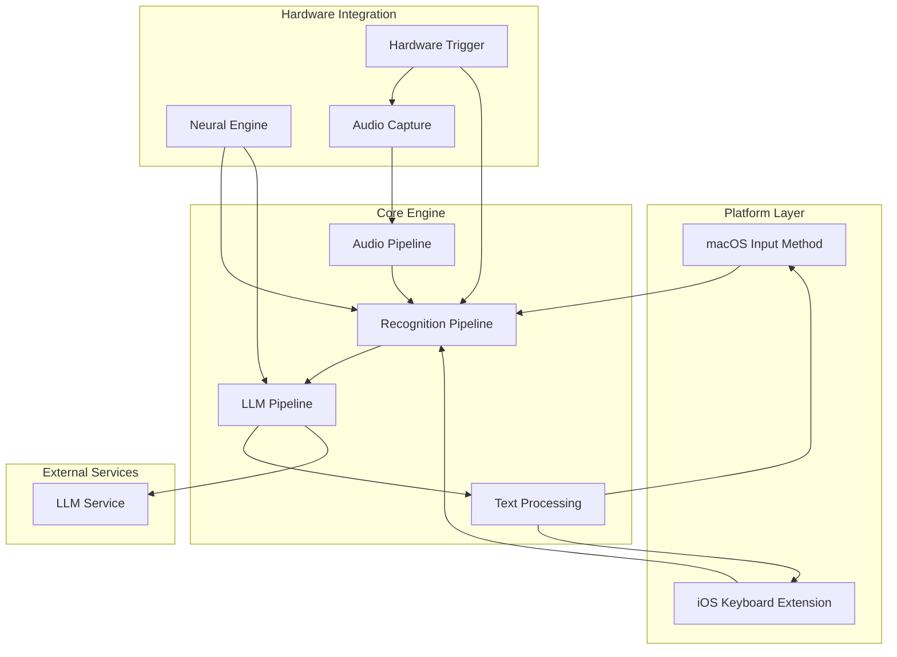
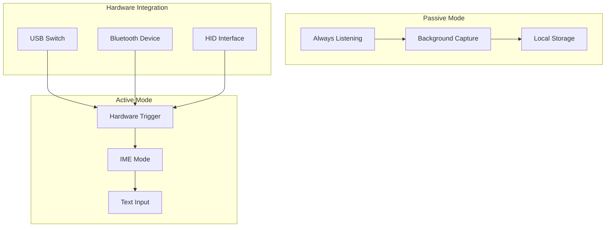
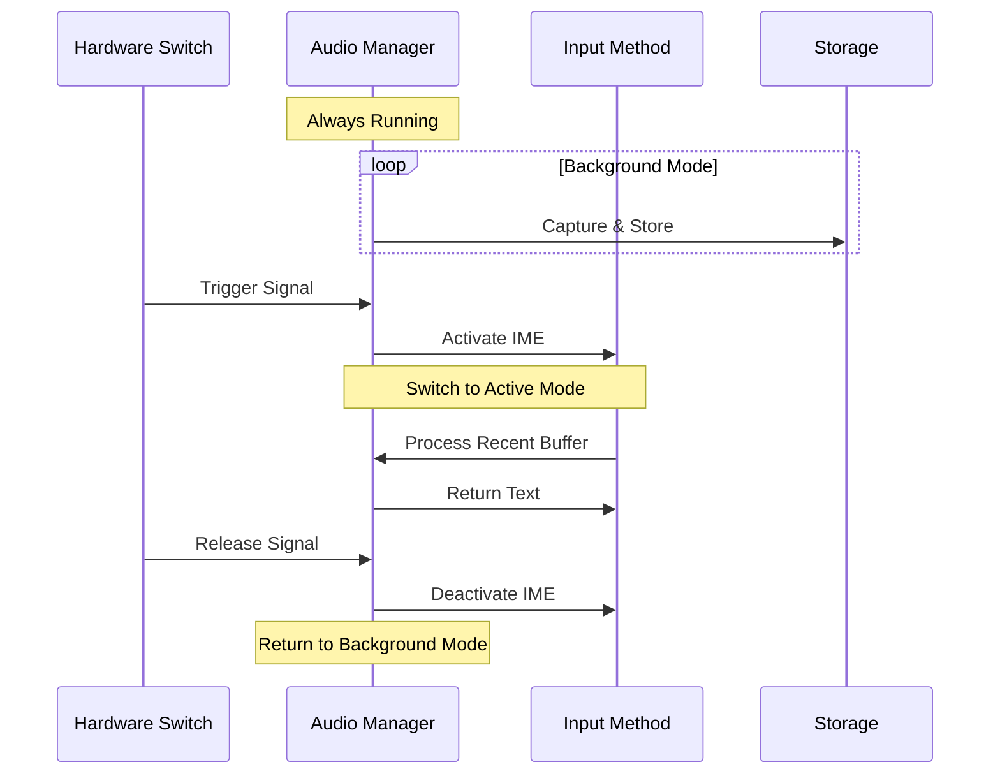
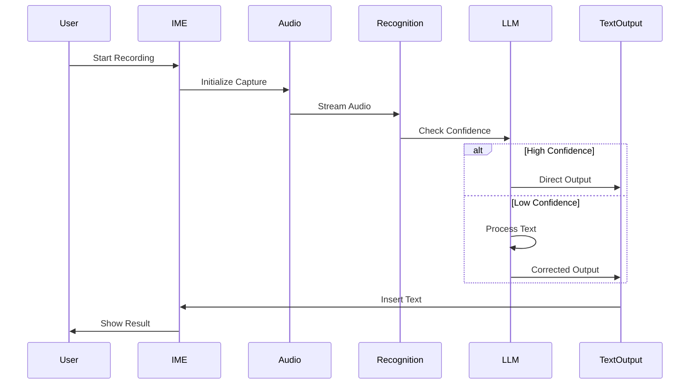
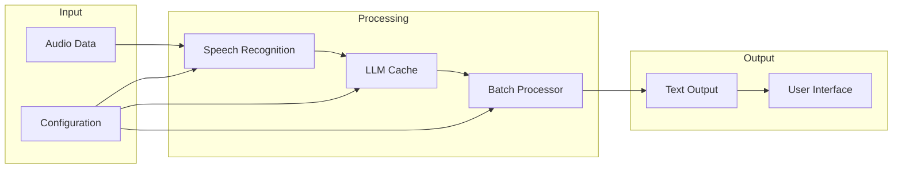
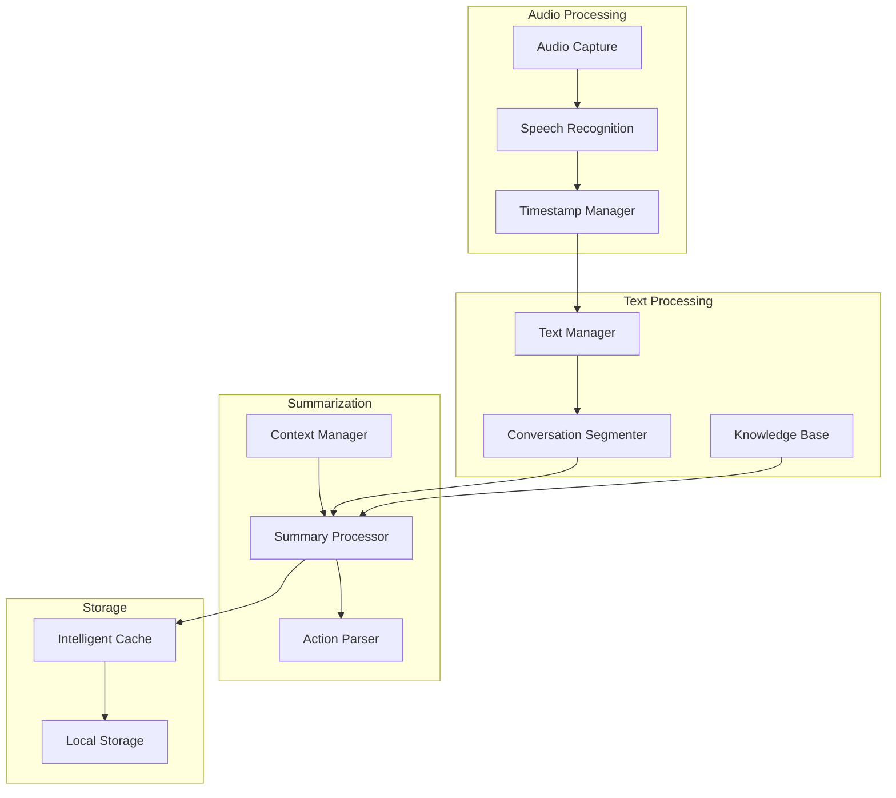
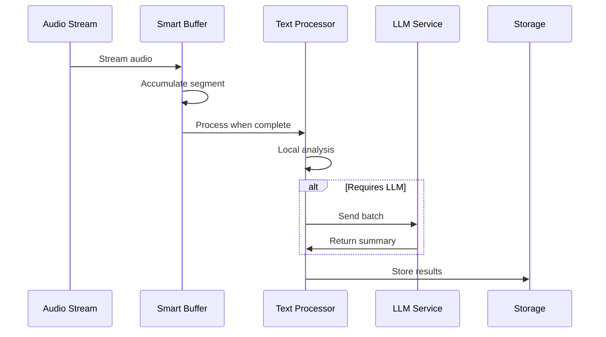
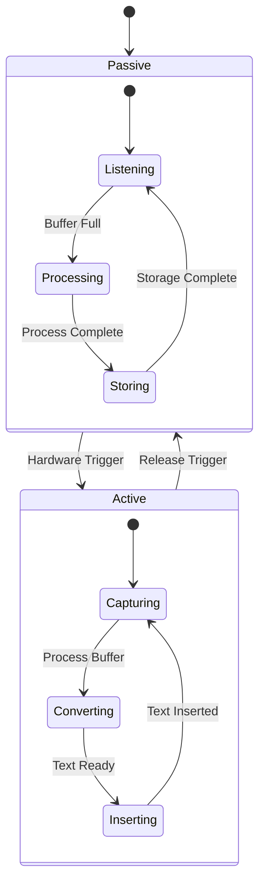

# Audio IME Architecture

## System Architecture



## Operational Modes

### Dual-Mode System


### Mode Switching Flow


## Component Interaction Flow

1. **User Input Flow**


## Data Flow



## Conversation Tracking & Summarization

### System Architecture


### Optimization Strategies

1. **LLM Usage Optimization**
   - Local preprocessing to identify significant segments
   - Batch processing of summaries
   - Incremental summarization
   - Context-aware compression

2. **Storage Optimization**
   - Tiered storage system
     * Hot: Recent conversations (in memory)
     * Warm: Summaries and actions (local cache)
     * Cold: Archive (compressed storage)
   - Intelligent pruning of redundant information
   - Vector embeddings for efficient retrieval

3. **Processing Pipeline**


### Key Components

1. **Smart Buffer**
```swift
class SmartBuffer {
    - Rolling window of recent audio
    - Automatic segmentation
    - Intelligent flush triggers
}
```

2. **Conversation Segmenter**
```swift
class ConversationSegmenter {
    - Speaker diarization
    - Topic detection
    - Natural breakpoint identification
}
```

3. **Summary Processor**
```swift
class SummaryProcessor {
    - Incremental summarization
    - Action item extraction
    - Priority scoring
}
```

4. **Storage Manager**
```swift
class StorageManager {
    - Tiered storage handling
    - Compression
    - Retention policies
}
```

### Optimization Metrics

1. **LLM Usage**
   - Target: < 1 API call per 5 minutes of conversation
   - Batch size: 10-15 segments per call
   - Context window: Maximum 2000 tokens

2. **Storage**
   - Raw audio: None (real-time processing only)
   - Text: < 1MB per hour of conversation
   - Summaries: < 100KB per hour
   - Actions: < 10KB per hour

3. **Processing**
   - Real-time transcription
   - Summary generation: < 30s delay
   - Action extraction: < 15s delay

### Integration with Existing IME

1. **Shared Components**
   - Audio capture system
   - Speech recognition engine
   - Text processing pipeline

2. **Additional Features**
   - Background processing
   - Notification system
   - Export capabilities

## Hardware Integration

### Switch Interface
1. **Connection Types**
   - USB HID Device
   - Bluetooth LE Device
   - GPIO Interface (for custom hardware)

2. **Signal Processing**
   - Debouncing
   - Multi-click detection
   - Long-press handling

3. **Power Management**
   - Low-power modes
   - Battery monitoring (for wireless)
   - Auto-sleep functionality

### State Management


## Component Details

### Core Components

1. **Audio Capture System**
   - Handles real-time audio input
   - Manages audio sessions
   - Provides buffering and preprocessing

2. **Speech Recognition Engine**
   - Primary: Apple Neural Engine
   - Fallback: Whisper.cpp
   - Handles language detection and processing

3. **LLM Processing Pipeline**
   - Confidence evaluation
   - Batch processing
   - Caching system
   - Error correction

4. **Text Processing**
   - Format management
   - Input method integration
   - Context handling

### Platform Integration

1. **macOS Integration**
   - Input Method Kit framework
   - Status bar management
   - System preferences
   - Keyboard event handling

2. **iOS Integration**
   - Custom keyboard extension
   - Touch interaction
   - System integration

## Performance Considerations

1. **Neural Engine Optimization**
   - Dynamic power management
   - Batch processing optimization
   - Cache management

2. **Memory Management**
   - Audio buffer optimization
   - Recognition result caching
   - LLM context management

3. **Battery Efficiency**
   - Power mode adaptation
   - Processing throttling
   - Background task management
